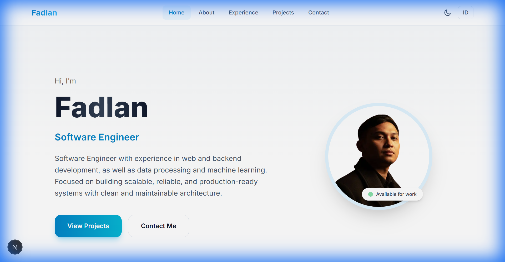
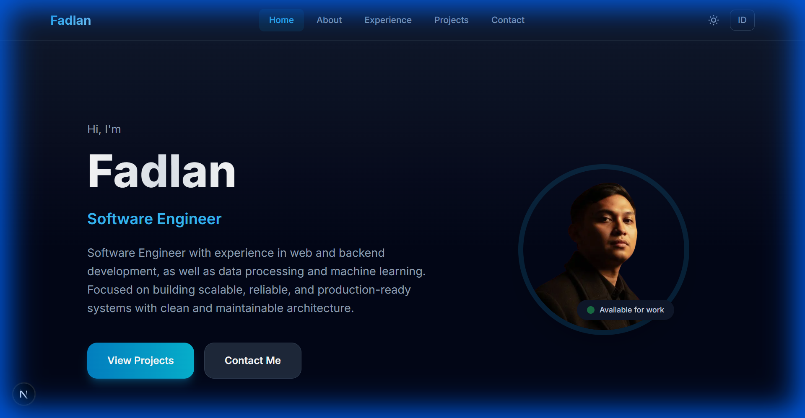
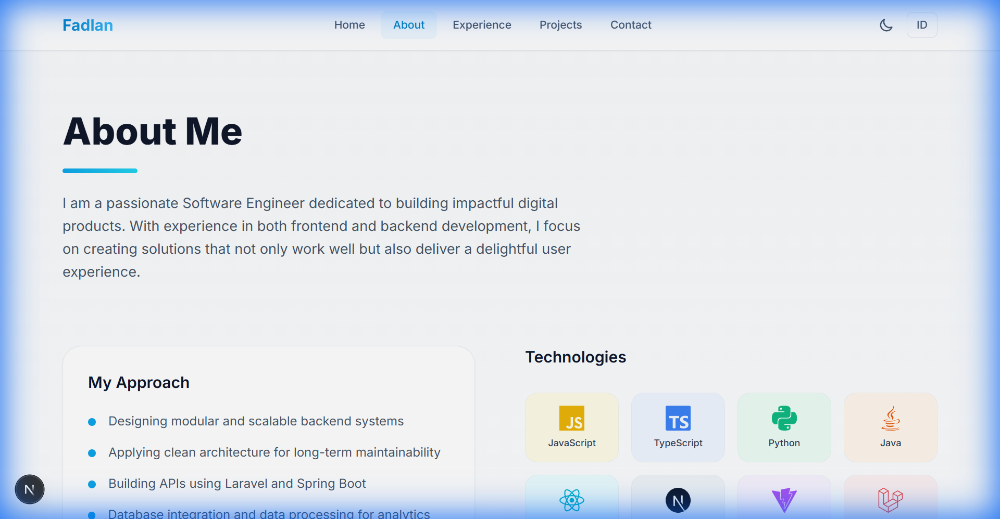
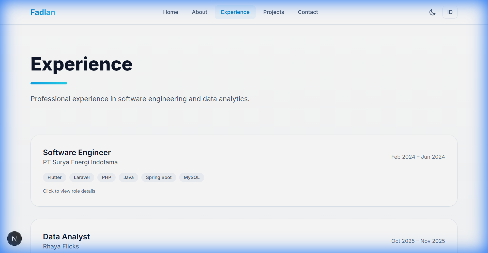
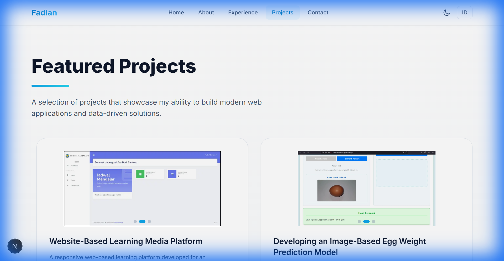
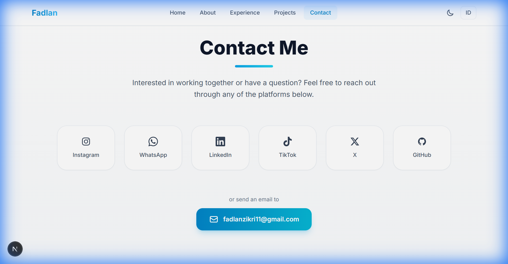

<p align="center">
  
</p>

<h1 align="center">🚀 Personal Portfolio Website</h1>

<p align="center">
  <strong>Modern, Responsive & Minimalist Portfolio</strong><br>
  Built with Next.js 16, Tailwind CSS, and Framer Motion
</p>

<p align="center">
  <a href="https://fadlan-portofolio-dev.vercel.app/">
    
  </a>
  
  
  
</p>

---

## ✨ Features

| Feature                | Description                                               |
| ---------------------- | --------------------------------------------------------- |
| 🌓 **Dark/Light Mode** | Toggle antara tema gelap dan terang dengan transisi halus |
| 🌐 **Bilingual**       | Dukungan bahasa Indonesia dan English                     |
| 🎨 **Modern UI**       | Desain minimalis dengan glassmorphism dan gradient modern |
| 📱 **Responsive**      | Tampilan optimal di semua ukuran layar                    |
| ⚡ **Fast**            | Performa tinggi dengan Next.js Turbopack                  |
| 🎭 **Animations**      | Animasi halus menggunakan Framer Motion                   |

---

## 📸 Screenshots

### 🏠 Hero Section - Light Mode

<p align="center">
  
</p>

### 🌙 Hero Section - Dark Mode

<p align="center">
  
</p>

### 👤 About Section

<p align="center">
  
</p>

### 💼 Experience Section

<p align="center">
  
</p>

### 🛠️ Projects Section

<p align="center">
  
</p>

### 📬 Contact Section

<p align="center">
  
</p>

---

## 🛠️ Tech Stack

<table>
  <tr>
    <td align="center" width="96">
      
      <br><strong>Next.js 16</strong>
    </td>
    <td align="center" width="96">
      
      <br><strong>React 19</strong>
    </td>
    <td align="center" width="96">
      
      <br><strong>Tailwind CSS</strong>
    </td>
    <td align="center" width="96">
      
      <br><strong>Framer Motion</strong>
    </td>
  </tr>
</table>

---

## 📁 Project Structure

```
nextjs-porto/
├── 📂 components/       # Reusable components
│   ├── LanguageToggle.jsx
│   ├── Navbar.jsx
│   └── ProjectCard.jsx
├── 📂 context/          # React Context providers
│   ├── LanguageContext.jsx
│   └── ThemeContext.jsx
├── 📂 data/             # Static data files
│   ├── content.js       # UI text (ID/EN)
│   ├── experience.js    # Work experience data
│   └── projects.js      # Projects data
├── 📂 hooks/            # Custom hooks
├── 📂 pages/            # Next.js pages
│   ├── _app.js
│   └── index.js
├── 📂 public/           # Static assets
│   └── images/
├── 📂 sections/         # Page sections
│   ├── About.jsx
│   ├── Contact.jsx
│   ├── Experience.jsx
│   ├── Hero.jsx
│   └── Projects.jsx
├── 📂 styles/           # CSS styles
├── next.config.js
├── tailwind.config.js
└── package.json
```

---

## 🚀 Quick Start

### Prerequisites

- **Node.js** >= 18.x
- **npm** or **yarn**

### Installation

1. **Clone the repository**

   ```bash
   git clone https://github.com/fadlnsyah/web-porto.git
   cd web-porto
   ```

2. **Install dependencies**

   ```bash
   npm install
   # or
   yarn install
   ```

3. **Run development server**

   ```bash
   npm run dev
   # or
   yarn dev
   ```

4. **Open in browser**
   ```
   http://localhost:3000
   ```

---

## 📦 Build & Deploy

### Build for Production

```bash
npm run build
```

### Start Production Server

```bash
npm run start
```

### Deploy to Vercel

1. Push your code to GitHub
2. Import project di [Vercel](https://vercel.com)
3. Click **Deploy** - Done! ✨

[](https://vercel.com/new/clone?repository-url=https://github.com/fadlnsyah/web-porto)

---

## ⚙️ Customization

### 📝 Edit Personal Info

Edit file `data/content.js` untuk mengubah informasi personal:

```javascript
const content = {
  id: {
    hero: {
      greeting: "Halo, saya",
      name: "Nama Kamu",
      role: "Role Kamu",
      subtitle: "Deskripsi singkat tentang dirimu...",
    },
    // ... lainnya
  },
  en: {
    // English version
  },
};
```

### 💼 Add Work Experience

Edit file `data/experience.js`:

```javascript
const experience = {
  id: [
    {
      id: 1,
      company: "Nama Perusahaan",
      role: "Posisi Kamu",
      period: "Jan 2024 - Present",
      description: "Deskripsi pekerjaan...",
      tech: ["Tech1", "Tech2"],
    },
    // ... tambah pengalaman lain
  ],
};
```

### 🛠️ Add Projects

Edit file `data/projects.js`:

```javascript
const projects = {
  id: [
    {
      id: 1,
      title: "Nama Project",
      description: "Deskripsi project...",
      tech: ["Next.js", "Tailwind CSS"],
      images: ["/images/projects/project-name/preview.png"],
      github: "https://github.com/username/repo",
      website: "https://your-project.com",
    },
    // ... tambah project lain
  ],
};
```

---

## 🎨 Theming

Website sudah dilengkapi dengan **Dark Mode** dan **Light Mode** yang dapat di-toggle melalui navbar.

Untuk kustomisasi tema, edit file `tailwind.config.js`:

```javascript
module.exports = {
  darkMode: "class",
  theme: {
    extend: {
      colors: {
        // Kustomisasi warna di sini
      },
    },
  },
};
```

---

## 📄 Available Scripts

| Script          | Description                               |
| --------------- | ----------------------------------------- |
| `npm run dev`   | Start development server dengan Turbopack |
| `npm run build` | Build production bundle                   |
| `npm run start` | Start production server                   |

---

## 🤝 Contributing

Contributions are welcome! Feel free to:

1. Fork the project
2. Create your feature branch (`git checkout -b feature/AmazingFeature`)
3. Commit your changes (`git commit -m 'Add some AmazingFeature'`)
4. Push to the branch (`git push origin feature/AmazingFeature`)
5. Open a Pull Request

---

## 📄 License

This project is open source and available under the [MIT License](LICENSE).

---

## 👨‍💻 Author

**Fadlan**

[](https://github.com/fadlnsyah)
[](https://linkedin.com/in/fadlnsyah)

---

<p align="center">
  Made with ❤️ and ☕
</p>
